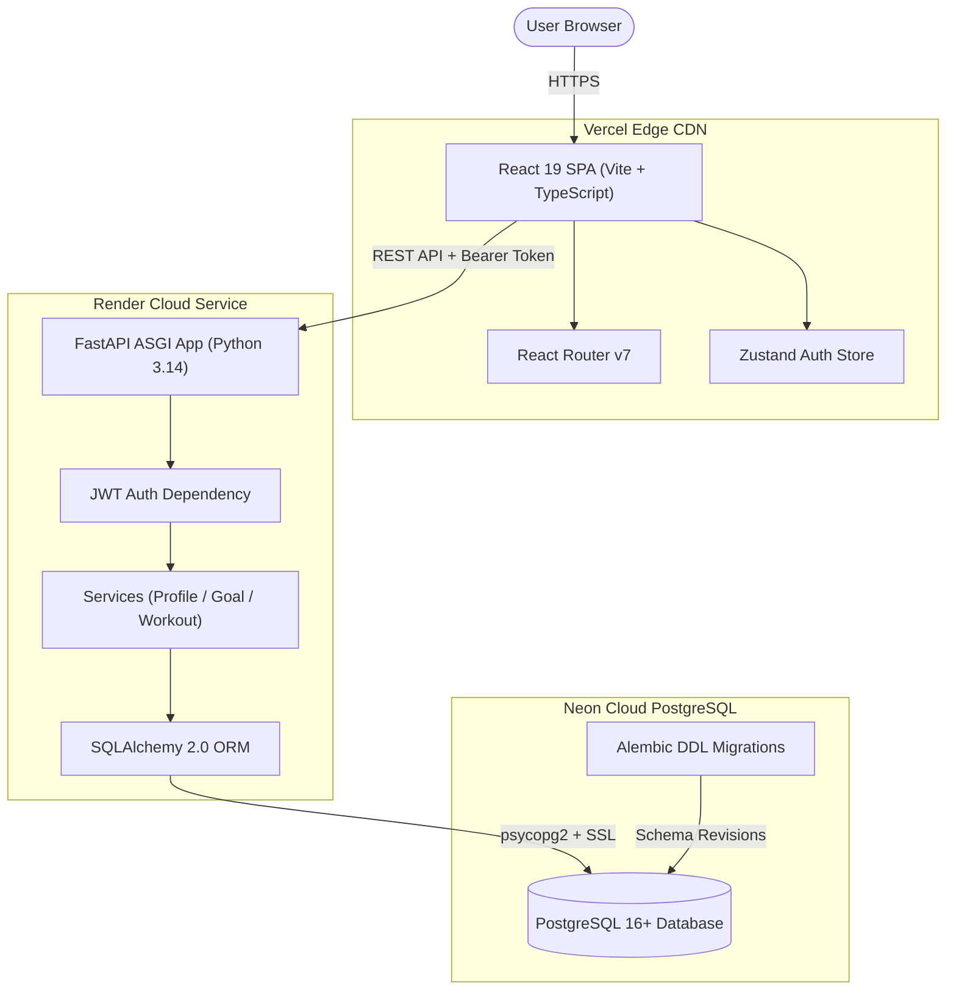

# FitMind AI

A full-stack, personalized fitness platform built with deterministic health calculation engines, persistent profile memory, and a decoupled FastAPI / React 19 architecture.

---

## Live Production Deployment

* **Frontend Application (Vercel):** [https://fitmind-ai-omega.vercel.app](https://fitmind-ai-omega.vercel.app)
* **Backend REST API (Render):** [https://fitmindai-ur71.onrender.com/health](https://fitmindai-ur71.onrender.com/health)
* **Database (Neon PostgreSQL):** Serverless PostgreSQL 16+

---

## Repository Context

FitMind AI is a engineering portfolio project demonstrating full-stack software architecture, data modeling, authentication security, and cloud deployment. 

The application separates **deterministic calculations** (BMR/TDEE calculations, macro allocation, physical metrics) from **reasoning layers**, ensuring that numerical health data remains exact, testable, and auditable server-side.

---

## Currently Implemented Features

* **JWT-Based Authentication System:**
  * Account registration (`POST /api/v1/auth/register`) with Bcrypt password hashing.
  * User login (`POST /api/v1/auth/login`) issuing JWT access tokens (HS256 signature).
  * Server-side refresh token database tracking (`POST /api/v1/auth/refresh`) and token revocation (`POST /api/v1/auth/logout`).
  * React client session restoration and automatic token refresh via Axios interceptors.

* **5-Step Onboarding Wizard UI:**
  * Step 1: Personal Demographics (Full Name, Date of Birth, Gender).
  * Step 2: Fitness Goals (Primary Goal, Target Weight, Target Date).
  * Step 3: Physical Metrics & Activity Tiers (Height, Weight, Activity Level).
  * Step 4: Preferences & Constraints (Dietary preference, Training equipment multi-selection, Medical notes).
  * Step 5: Initial Baseline Assessment (Calculates baseline BMR & TDEE).

* **Deterministic TDEE & Baseline Engine:**
  * Implements the Mifflin-St Jeor equation to compute Basal Metabolic Rate (BMR).
  * Applies activity multipliers ($1.20\text{--}1.90$) to compute Total Daily Energy Expenditure (TDEE).

* **Application Shell & Navigation:**
  * Responsive layout featuring Desktop Sidebar, Mobile TopBar Drawer, and Mobile Bottom Navigation.
  * Protected route guard (`<ProtectedRoute>`) restricting unauthenticated access.
  * Non-blocking dashboard reminder card directing un-onboarded users to `/onboarding`.

* **User Profile & Account Settings (`/profile`):**
  * Full viewing and editing support for user demographics, physical metrics (`weight_kg`, `height_cm`), equipment, and medical constraints.
  * Client-side validation ($50\text{--}300\text{ cm}$ height, $30\text{--}300\text{ kg}$ weight) and inline feedback alerts.

* **Relational Database & DDL Version Control:**
  * Managed PostgreSQL persistence via SQLAlchemy 2.0 ORM.
  * Version-controlled DDL migration chain using Alembic (`0001` $\rightarrow$ `0005`).

---

## Screenshots

> *Placeholder: Interface screenshots of the Landing Page, 5-Step Onboarding Wizard, Dashboard, and Profile Settings screen can be added here.*

---

## System Architecture



---

## Technology Stack

| Domain | Technology | Description |
|---|---|---|
| **Frontend Framework** | React 19, TypeScript 6.0 | Component-based UI library & strict static typing |
| **Build & Tooling** | Vite 8.2, Oxlint | High-performance ES build tool & static code linter |
| **State & Routing** | Zustand 5.0, React Router v7 | Global session state management & SPA client routing |
| **Forms & Validation** | React Hook Form, Zod 4.4 | Type-safe form validation schemas |
| **Backend Framework** | Python 3.14, FastAPI 0.110 | Asynchronous RESTful API framework |
| **ORM & Migrations** | SQLAlchemy 2.0, Alembic 1.13 | Declarative database mapping & DDL migration history |
| **Database** | PostgreSQL | Serverless cloud PostgreSQL database hosted on Neon |
| **Security** | PyJWT, Passlib, Bcrypt | Signed JWT tokens & bcrypt password hashing |
| **Infrastructure** | Vercel, Render | Edge CDN static hosting & backend ASGI web service |
| **Testing** | Vitest, Testing Library, Pytest | Unit & integration test runners for UI and API tiers |

---

## Backend Architecture

The backend follows a clean **Layered Architecture** separating network routing, business logic, data validation, and database operations:

```
backend/app/
├── api/          # Routers and HTTP request endpoints (/api/v1 versioning)
├── services/     # Business logic, calculation engines, & database transactions
├── models/       # SQLAlchemy ORM database entities
├── schemas/      # Pydantic data validation contracts (Request / Response)
└── core/         # Security primitives, database connection pooling, & config
```

* **API Layer:** Handles request routing, HTTP status codes, and dependency injection (`get_current_user`, `get_db`).
* **Service Layer:** Houses core business rules, Mifflin-St Jeor calculations, and transactional database logic.
* **ORM Layer:** Maps Python objects to PostgreSQL relational tables using SQLAlchemy 2.0.

---

## Database Design

Schema changes are version-controlled in Git using Alembic DDL migrations (`backend/alembic/versions/`):

| Revision | Migration Description |
|---|---|
| `2026_08_16_0001` | Creates `users` & `refresh_tokens` tables |
| `2026_08_16_0002` | Creates `profiles` table |
| `2026_08_16_0003` | Creates `goals` table |
| `2026_08_16_0004` | Adds `weight_kg` column to `profiles` |
| `2026_08_16_0005` | Creates `exercises`, `workout_plans`, `workout_plan_exercises`, `workout_logs`, `workout_log_exercises` |

### Core Implemented Entities

* **`users`:** `id (UUID)`, `email (unique)`, `hashed_password`, `is_active`, `is_verified`, `created_at`.
* **`refresh_tokens`:** `id (UUID)`, `user_id (FK)`, `token (unique)`, `expires_at`, `is_revoked`.
* **`profiles`:** `id (UUID)`, `user_id (FK)`, `full_name`, `date_of_birth`, `gender`, `height_cm`, `weight_kg`, `activity_level`, `diet_preference`, `equipment (JSON)`, `medical_notes`, `onboarding_complete`.
* **`goals`:** `id (UUID)`, `user_id (FK)`, `goal_type`, `target_weight_kg`, `target_date`, `is_active`.

---

## API Overview

### Authentication (`/api/v1/auth`)

| Method | Path | Purpose | Auth Required |
|---|---|---|---|
| `POST` | `/api/v1/auth/register` | Register a new user account | No |
| `POST` | `/api/v1/auth/login` | Authenticate user & return access/refresh tokens | No |
| `POST` | `/api/v1/auth/refresh` | Issue new access token using a valid refresh token | No |
| `POST` | `/api/v1/auth/logout` | Revoke active refresh token | Yes |

### User Profile (`/api/v1/profile`)

| Method | Path | Purpose | Auth Required |
|---|---|---|---|
| `GET` | `/api/v1/profile` | Retrieve active user's profile | Yes |
| `PUT` | `/api/v1/profile` | Update profile demographics & physical metrics | Yes |
| `POST` | `/api/v1/profile/onboarding` | Submit completed 5-step onboarding payload | Yes |

### Fitness Goals (`/api/v1/goals`)

| Method | Path | Purpose | Auth Required |
|---|---|---|---|
| `GET` | `/api/v1/goals/active` | Retrieve active fitness goal | Yes |
| `POST` | `/api/v1/goals` | Create/update user fitness goal | Yes |

### Health Check

| Method | Path | Purpose | Auth Required |
|---|---|---|---|
| `GET` | `/health` | System health check (`{"status": "ok"}`) | No |

---

## Authentication & Security

* **JWT Bearer Authorization:** HTTP requests pass access tokens in `Authorization: Bearer <token>` headers.
* **Token Expiration & Revocation:** Access tokens expire in 60 minutes. Refresh tokens are tracked in PostgreSQL with revocation capabilities (`is_revoked = True`).
* **Bcrypt Password Security:** User passwords are salted and hashed using Bcrypt before database storage.
* **CORS Origin Scoping:** FastAPI `CORSMiddleware` enforces origin checks configured via environment variables (`CORS_ORIGINS`).
* **Secret Isolation:** Database connection strings, API URLs, and JWT secrets are managed via platform environment variables and excluded from version control (`.gitignore`).

---

## Testing

Both application tiers are covered by automated test suites:

* **Frontend Unit & UI Tests (Vitest):** **63 passed** across 11 test files (`auth.test.tsx`, `ui_auth.test.tsx`, `onboarding.test.tsx`, `appshell.test.tsx`, `profile.test.tsx`, `tdeeCalculator.test.ts`, `workout.test.tsx`, `nutrition.test.tsx`, `progress.test.tsx`, `fitnessScore.test.tsx`, `unitConversion.test.ts`).
* **Backend Integration Tests (Pytest):** **83 passed** across 11 test modules (`test_auth.py`, `test_profile.py`, `test_goals.py`, `test_calculations.py`, `test_health.py`, `test_workout.py`, `test_nutrition.py`, `test_progress.py`, `test_fitness_score.py`, `test_config.py`, `test_adversarial_verification.py`).
* **Static Analysis:** Oxlint passes with **0 warnings and 0 errors** across 90 files.

```bash
# Run Frontend Test Suite
npm run test

# Run Backend Test Suite
cd backend && .venv/bin/pytest
```

---

## Project Roadmap

### Completed Phases
- [x] **Phase 0 — Pre-Development Setup & Architecture Lock:** System documentation, API contracts, database schema, design system.
- [x] **Phase 1 — Auth & Onboarding:** JWT authentication, user registration/login, 5-step onboarding wizard.
- [x] **Phase 2 — Application Shell, Dashboard & Profile:** AppShell layout, baseline TDEE dashboard, interactive profile settings (`/profile`), production cloud deployment.
- [x] **Phase 3 — Workout System:** Active workout plan view, exercise catalog search, live session execution logger with sets/reps/weight/RPE.
- [x] **Phase 4 — Nutrition Module:** Meal logging (breakfast, lunch, dinner, snack), target date summaries, macro breakdown tracking.
- [x] **Phase 5 — Progress Analytics:** Body weight history charts, body measurement tracking in inches (cm canonical DB storage).
- [x] **Phase 6 — Fitness Score Engine:** Weekly 0-100 deterministic fitness score calculation based on workout volume, protein adherence, logging consistency, and recovery.

### Next Phases
- [ ] **Phase 7 — AI Coach:** Interactive chat interface with persistent memory retrieval (RAG) and proactive coaching tips.

---

## Local Development Setup

### Prerequisites
* Node.js 20+
* Python 3.10+
* Git

### 1. Clone Repository
```bash
git clone https://github.com/manthanshah07/FitmindAI.git
cd FitmindAI
```

### 2. Frontend Setup (Terminal 1)
```bash
# Install dependencies
npm install

# Start Vite dev server
npm run dev
```
Frontend runs locally at `http://localhost:5173`.

### 3. Backend Setup (Terminal 2)
```bash
cd backend

# Create & activate virtual environment
python3 -m venv .venv
source .venv/bin/activate

# Install Python dependencies
pip install -r requirements.txt

# Run migrations against local SQLite database
DATABASE_URL="sqlite:///./dev.db" .venv/bin/alembic upgrade head

# Start FastAPI uvicorn dev server
DATABASE_URL="sqlite:///./dev.db" .venv/bin/uvicorn app.main:app --port 8000 --reload
```
Backend API runs locally at `http://localhost:8000`. API documentation is accessible at `http://localhost:8000/docs`.

---

## Production Deployment Overview

The application is deployed across separate production cloud environments:

* **Frontend (Vercel):** Hosts the static React Single Page Application (SPA). `vercel.json` provides rewrite rules for SPA client routing.
* **Backend (Render):** Hosts the FastAPI ASGI web service (`backend/render.yaml` defines build, migration release, and start commands).
* **Database (Neon PostgreSQL):** Managed serverless PostgreSQL database connected via SSL.

### Environment Variables

#### Backend (Render Dashboard)
```ini
ENVIRONMENT=production
DATABASE_URL=postgresql://<user>:<password>@<host>:5432/<dbname>?sslmode=require
JWT_SECRET=<32_byte_random_string>
JWT_ALGORITHM=HS256
JWT_EXPIRE_MINUTES=60
CORS_ORIGINS=https://fitmind-ai-omega.vercel.app
```

#### Frontend (Vercel Dashboard)
```ini
VITE_API_BASE_URL=https://fitmindai-ur71.onrender.com/api/v1
```

---

## Repository Structure

```
FitmindAI/
├── src/                        # React 19 Frontend Codebase
│   ├── components/             # UI Primitives (Button, Input, Card, Select)
│   │   └── layout/             # AppShell, Sidebar, TopBar, BottomNav
│   ├── pages/                  # Screen pages (auth, onboarding, dashboard, profile)
│   ├── lib/                    # Axios API client, Query setup, Token storage
│   ├── store/                  # Zustand global auth store
│   ├── types/                  # TypeScript domain models (Auth, Profile, Goal)
│   ├── utils/                  # Mifflin-St Jeor TDEE calculator & error parsers
│   └── tests/                  # Vitest UI & integration tests
├── backend/                    # FastAPI Backend Codebase
│   ├── app/
│   │   ├── api/                # API controllers & route versioning (/api/v1)
│   │   ├── core/               # App configuration, security, DB engine
│   │   ├── models/             # SQLAlchemy ORM database models
│   │   ├── schemas/            # Pydantic validation request/response schemas
│   │   └── services/           # Business logic & database operations
│   ├── alembic/                # Version-controlled DDL migration scripts
│   └── tests/                  # Pytest backend integration test suites
├── docs/                       # Comprehensive project documentation
├── vercel.json                 # Vercel SPA routing rewrite rules
└── README.md
```

---

## Engineering Decisions & Implementation Details

* **Separation of Computation & Reasoning:** Health metrics (BMR, TDEE, macro ratios) are computed deterministically in code rather than generated by non-deterministic LLMs.
* **Strict Decoupled Architecture:** Client communicates with the server via structured JSON payloads over REST, allowing independent scaling and maintenance of frontend and backend tiers.
* **Database Migration Discipline:** Database schema updates are managed through version-controlled Alembic DDL scripts in Git.
* **Zero Committed Secrets:** Credentials, JWT secrets, and connection strings are managed via platform environment variables.

---

## Current Limitations

* **Workout Execution Logging (Phase 3):** Workout ORM models and backend endpoints are complete; frontend workout logging UI is currently in progress.
* **Rate Limiting:** Server-side API rate limiting is planned for production v1.1.
* **Email Verification:** Account creation currently defaults `is_verified = False`; live email verification flow is planned for production v1.1.

---

## License

This repository is maintained as an engineering project portfolio. Licensing details to be specified.
