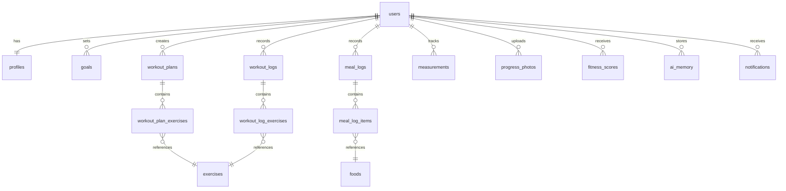

# FitMind AI — Database Design

> **Status:** PROPOSED — Not yet implemented  
> **Database:** PostgreSQL  
> **Last Updated:** 2026-08-11

---

## Design Principles

- All structured data lives in PostgreSQL
- Foreign key constraints enforced at database level
- All timestamps use `TIMESTAMPTZ` (UTC)
- Soft deletes preferred where user data must be preserved for AI context
- No client-generated UUIDs for primary keys — use `gen_random_uuid()` server-side

---

## Entity Relationship Overview

```
Users
 └── Profiles (1:1)
 └── Goals (1:many)
 └── WorkoutPlans (1:many)
 │     └── WorkoutPlanExercises (many)
 │           └── Exercises (many:1)
 └── WorkoutLogs (1:many)
 │     └── WorkoutLogExercises (many)
 └── MealLogs (1:many)
 │     └── MealLogItems (many)
 │           └── Foods (many:1)
 └── Measurements (1:many)
 └── ProgressPhotos (1:many)
 └── FitnessScores (1:many)
 └── AIMemory (1:many)
 └── Notifications (1:many)
```

---

## Table Definitions

### `users`
| Column | Type | Constraints | Notes |
|---|---|---|---|
| `id` | UUID | PK, NOT NULL, DEFAULT gen_random_uuid() | |
| `email` | VARCHAR(255) | UNIQUE, NOT NULL | |
| `password_hash` | VARCHAR(255) | NOT NULL | bcrypt hash |
| `is_active` | BOOLEAN | DEFAULT true | |
| `is_verified` | BOOLEAN | DEFAULT false | Email verification |
| `created_at` | TIMESTAMPTZ | DEFAULT now() | |
| `updated_at` | TIMESTAMPTZ | DEFAULT now() | |

---

### `profiles`
| Column | Type | Constraints | Notes |
|---|---|---|---|
| `id` | UUID | PK | |
| `user_id` | UUID | FK → users.id, UNIQUE | 1:1 with users |
| `full_name` | VARCHAR(100) | NOT NULL | |
| `date_of_birth` | DATE | | |
| `gender` | VARCHAR(20) | | 'male', 'female', 'other', 'prefer_not_to_say' |
| `height_cm` | DECIMAL(5,2) | | |
| `activity_level` | VARCHAR(30) | | 'sedentary', 'light', 'moderate', 'very_active', 'extra_active' |
| `diet_preference` | VARCHAR(50) | | 'omnivore', 'vegetarian', 'vegan', 'keto', etc. |
| `equipment` | TEXT[] | | Array of available equipment strings |
| `medical_notes` | TEXT | | Optional; handled with care |
| `onboarding_complete` | BOOLEAN | DEFAULT false | |
| `created_at` | TIMESTAMPTZ | DEFAULT now() | |
| `updated_at` | TIMESTAMPTZ | DEFAULT now() | |

---

### `goals`
| Column | Type | Constraints | Notes |
|---|---|---|---|
| `id` | UUID | PK | |
| `user_id` | UUID | FK → users.id | |
| `goal_type` | VARCHAR(50) | NOT NULL | 'weight_loss', 'muscle_gain', 'maintain', 'endurance', 'general_fitness' |
| `target_weight_kg` | DECIMAL(5,2) | | Optional |
| `target_date` | DATE | | Optional |
| `is_active` | BOOLEAN | DEFAULT true | Only one active goal at a time |
| `created_at` | TIMESTAMPTZ | DEFAULT now() | |

---

### `exercises`
| Column | Type | Constraints | Notes |
|---|---|---|---|
| `id` | UUID | PK | |
| `name` | VARCHAR(100) | UNIQUE, NOT NULL | |
| `primary_muscle` | VARCHAR(50) | NOT NULL | |
| `secondary_muscles` | TEXT[] | | |
| `equipment_required` | TEXT[] | | |
| `difficulty` | VARCHAR(20) | | 'beginner', 'intermediate', 'advanced' |
| `category` | VARCHAR(50) | | 'strength', 'cardio', 'flexibility', etc. |
| `description` | TEXT | | |
| `instructions` | TEXT | | Step-by-step |
| `created_at` | TIMESTAMPTZ | DEFAULT now() | |

---

### `workout_plans`
| Column | Type | Constraints | Notes |
|---|---|---|---|
| `id` | UUID | PK | |
| `user_id` | UUID | FK → users.id | |
| `name` | VARCHAR(100) | NOT NULL | |
| `days_per_week` | INTEGER | | |
| `is_active` | BOOLEAN | DEFAULT true | |
| `ai_generated` | BOOLEAN | DEFAULT false | |
| `created_at` | TIMESTAMPTZ | DEFAULT now() | |

---

### `workout_plan_exercises`
| Column | Type | Constraints | Notes |
|---|---|---|---|
| `id` | UUID | PK | |
| `plan_id` | UUID | FK → workout_plans.id | |
| `exercise_id` | UUID | FK → exercises.id | |
| `day_of_week` | INTEGER | | 1=Monday, 7=Sunday |
| `sets` | INTEGER | | |
| `reps` | VARCHAR(20) | | Can be range e.g. "8-12" |
| `rest_seconds` | INTEGER | | |
| `notes` | TEXT | | |
| `order_index` | INTEGER | | For UI ordering |

---

### `workout_logs`
| Column | Type | Constraints | Notes |
|---|---|---|---|
| `id` | UUID | PK | |
| `user_id` | UUID | FK → users.id | |
| `plan_id` | UUID | FK → workout_plans.id, nullable | Can log ad-hoc |
| `started_at` | TIMESTAMPTZ | NOT NULL | |
| `ended_at` | TIMESTAMPTZ | | |
| `notes` | TEXT | | |
| `created_at` | TIMESTAMPTZ | DEFAULT now() | |

---

### `workout_log_exercises`
| Column | Type | Constraints | Notes |
|---|---|---|---|
| `id` | UUID | PK | |
| `log_id` | UUID | FK → workout_logs.id | |
| `exercise_id` | UUID | FK → exercises.id | |
| `set_number` | INTEGER | NOT NULL | |
| `reps_completed` | INTEGER | | |
| `weight_kg` | DECIMAL(6,2) | | |
| `rpe` | INTEGER | | Rate of Perceived Exertion 1-10 |
| `notes` | TEXT | | |

---

### `foods`
| Column | Type | Constraints | Notes |
|---|---|---|---|
| `id` | UUID | PK | |
| `name` | VARCHAR(200) | NOT NULL | |
| `brand` | VARCHAR(100) | | Optional |
| `calories_per_100g` | DECIMAL(7,2) | | |
| `protein_per_100g` | DECIMAL(6,2) | | |
| `carbs_per_100g` | DECIMAL(6,2) | | |
| `fat_per_100g` | DECIMAL(6,2) | | |
| `fiber_per_100g` | DECIMAL(6,2) | | |
| `is_verified` | BOOLEAN | DEFAULT false | Admin-verified entries |
| `created_at` | TIMESTAMPTZ | DEFAULT now() | |

---

### `meal_logs`
| Column | Type | Constraints | Notes |
|---|---|---|---|
| `id` | UUID | PK | |
| `user_id` | UUID | FK → users.id | |
| `meal_type` | VARCHAR(20) | | 'breakfast', 'lunch', 'dinner', 'snack' |
| `logged_at` | TIMESTAMPTZ | NOT NULL | |
| `notes` | TEXT | | Raw user input if NLP-parsed |
| `created_at` | TIMESTAMPTZ | DEFAULT now() | |

---

### `meal_log_items`
| Column | Type | Constraints | Notes |
|---|---|---|---|
| `id` | UUID | PK | |
| `meal_log_id` | UUID | FK → meal_logs.id | |
| `food_id` | UUID | FK → foods.id | |
| `quantity_grams` | DECIMAL(8,2) | NOT NULL | |
| `calculated_calories` | DECIMAL(8,2) | | Computed at log time |
| `calculated_protein` | DECIMAL(7,2) | | |
| `calculated_carbs` | DECIMAL(7,2) | | |
| `calculated_fat` | DECIMAL(7,2) | | |

---

### `measurements`
| Column | Type | Constraints | Notes |
|---|---|---|---|
| `id` | UUID | PK | |
| `user_id` | UUID | FK → users.id | |
| `measured_at` | DATE | NOT NULL | |
| `weight_kg` | DECIMAL(5,2) | | |
| `chest_cm` | DECIMAL(5,2) | | |
| `waist_cm` | DECIMAL(5,2) | | |
| `hips_cm` | DECIMAL(5,2) | | |
| `bicep_cm` | DECIMAL(5,2) | | |
| `thigh_cm` | DECIMAL(5,2) | | |
| `body_fat_pct` | DECIMAL(4,1) | | Optional |
| `created_at` | TIMESTAMPTZ | DEFAULT now() | |

---

### `progress_photos`
| Column | Type | Constraints | Notes |
|---|---|---|---|
| `id` | UUID | PK | |
| `user_id` | UUID | FK → users.id | |
| `storage_url` | TEXT | NOT NULL | Supabase Storage URL |
| `taken_at` | DATE | NOT NULL | |
| `photo_type` | VARCHAR(20) | | 'front', 'back', 'side' |
| `created_at` | TIMESTAMPTZ | DEFAULT now() | |

---

### `fitness_scores`
| Column | Type | Constraints | Notes |
|---|---|---|---|
| `id` | UUID | PK | |
| `user_id` | UUID | FK → users.id | |
| `score` | INTEGER | NOT NULL, CHECK (0-100) | |
| `workout_adherence_pct` | DECIMAL(5,2) | | |
| `nutrition_score` | DECIMAL(5,2) | | |
| `protein_score` | DECIMAL(5,2) | | |
| `sleep_score` | DECIMAL(5,2) | | |
| `recovery_score` | DECIMAL(5,2) | | |
| `consistency_score` | DECIMAL(5,2) | | |
| `calculated_at` | TIMESTAMPTZ | NOT NULL | |
| `period_start` | DATE | NOT NULL | Week start |
| `period_end` | DATE | NOT NULL | Week end |

---

### `ai_memory`
| Column | Type | Constraints | Notes |
|---|---|---|---|
| `id` | UUID | PK | |
| `user_id` | UUID | FK → users.id | |
| `memory_type` | VARCHAR(30) | NOT NULL | 'static', 'dynamic', 'conversational' |
| `key` | VARCHAR(100) | NOT NULL | e.g. 'food_dislike', 'time_constraint' |
| `value` | TEXT | NOT NULL | The actual memory content |
| `source` | VARCHAR(50) | | 'conversation', 'system', 'user_action' |
| `relevance_score` | DECIMAL(4,3) | | For retrieval ranking |
| `created_at` | TIMESTAMPTZ | DEFAULT now() | |
| `updated_at` | TIMESTAMPTZ | DEFAULT now() | |
| `is_active` | BOOLEAN | DEFAULT true | Soft delete for stale memory |

---

### `notifications`
| Column | Type | Constraints | Notes |
|---|---|---|---|
| `id` | UUID | PK | |
| `user_id` | UUID | FK → users.id | |
| `type` | VARCHAR(50) | | 'weekly_report', 'streak', 'goal_update', etc. |
| `title` | VARCHAR(200) | NOT NULL | |
| `body` | TEXT | | |
| `is_read` | BOOLEAN | DEFAULT false | |
| `created_at` | TIMESTAMPTZ | DEFAULT now() | |

---

## Mermaid ER Diagram (Simplified)



---

*Migrations have NOT been created yet. This document is the design reference.*
